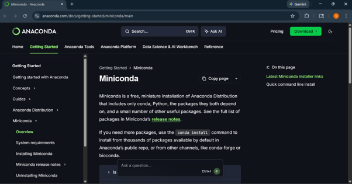
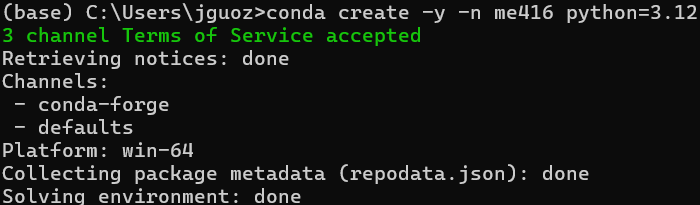
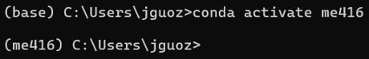
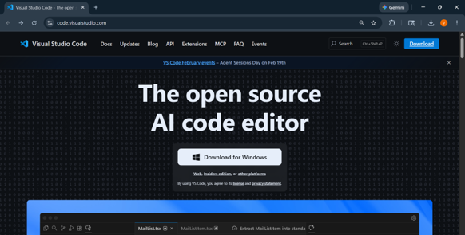

# Lab 0: Software Setup for All Labs

**MECH416: Introduction to Robotic Manipulators**

**Colorado State University**

**You need to finish this assignment before you come to Lab 1**

**1. Introduction**

Before coming to Lab 1, you need to set up the software environment used throughout this course. We will use this same setup to program and control various robot platforms.

By the end of this assignment, you will:

- Install Miniconda and Visual Studio Code (VS Code)

- Create an isolated Python environment

- Install the required Python packages

- Verify your setup and submit a confirmation code

Lab 1 will introduce you to Python programming using VS Code and the environment you have set by following the procedure listed here. 

**2. Required Software**

Before connecting the robot, we must install three essential tools:

1.  **Miniconda**

2.  **Visual Studio Code (VS Code)**

3.  **GitHub Copilot**

These tools allow you to manage Python environments and run code without affecting other software on your computer.

**3. Install Miniconda**

Miniconda is a lightweight Python distribution and environment manager. It lets you create isolated environments — think of each environment as a separate toolbox that contains only the tools needed for one specific project. No matter what else is installed on your computer, this course's toolbox stays clean and consistent for everyone in the lab.

Download Miniconda from the official website:
<https://docs.conda.io/en/latest/miniconda.html>

Select the installer for your operating system and follow the default installation steps.

After installation, restart your computer.

**4. Creating a Conda Environment**

A Conda environment is like a dedicated workspace for a specific project. Imagine you have a physical workbench in a lab: you set it up with exactly the tools you need for one task, and you do not mix in tools from other projects. When you come back the next day, everything is still arranged the way you left it.

In Python, an environment works the same way. It is a self-contained folder that holds a specific version of Python and any packages you install into it. Changes inside one environment do not affect any other environment or the rest of your computer.

For this course, we will create one environment named me416 and install all required packages into it. Every time you start working, you will activate this environment first — this is like walking up to your dedicated workbench rather than a random table.

To create an environment, open a terminal for your operating system:

-   Windows: Search for "Anaconda Prompt" in the Start menu and open it.

-   macOS: Open the Terminal app (Applications → Utilities → Terminal).

-   Linux: Open your system Terminal (e.g., Ctrl+Alt+T).

Then copy and paste the following command and run it:

**conda create -y -n me416 python=3.12**

This command creates a new, empty environment named me416 running Python 3.12 — LeRobot requires Python 3.12 or later. You only need to run this once. The -y flag automatically confirms all prompts, so you do not have to type "yes" manually. The -n flag (short for --name) sets the name of the environment — in this case, me416.

After creating the environment, we can activate the environment so that we can install required packages for this course.

**conda activate me416**

After activation, you should see the environment name in parentheses at the beginning of your terminal line:

This prefix confirms that you are now working inside the me416 environment. Any Python commands or package installations you run will apply only to this environment, not to other environments or the rest of your computer.

**5. Installing Required Packages**

A Python package is a collection of pre-written code that adds specific functionality to your programs — similar to how a MATLAB toolbox adds functions that are not part of base MATLAB. Instead of writing everything from scratch, you install a package and use its functions directly in your code.

With the me416 environment active, install the following packages by copying and pasting each command into your terminal.

a.  Installing ffmpeg, which is used for video and media handling.

**conda install ffmpeg=7.1.1 -c conda-forge**

b.  Cloning LeRobot from GitHub: LeRobot is the package used to control both the motor we will use in this course and the SO-ARM101 robot arm we will use later.

**git clone <https://github.com/huggingface/lerobot.git>**

Then navigate into the cloned directory:

**cd lerobot**

c.  Install the library in editable mode:

**pip install -e .**

d.  Installing the Feetech SDK (motor communication library):

**pip install -e ".[feetech]"**

e.  Installing other libraries: MuJoCo is a physics simulation engine we will use extensively in later labs to simulate robot motion. Matplotlib is a plotting library used to visualize data such as sensor readings and robot trajectories. ipywidgets provides interactive UI elements (sliders, buttons, etc.) for use in Jupyter notebooks.

**pip install mujoco matplotlib ipywidgets**

**6. Install VS Code**

Visual Studio Code (VS Code) is the code editor we will use throughout this course. It provides an integrated terminal, file browser, and debugger that make it easier to write and run Python code than using a plain command prompt.

Download VS Code from: <https://code.visualstudio.com/>

Select the version for your operating system and follow the default installation steps. On macOS, also open the Command Palette (Cmd+Shift+P) and run "Shell Command: Install 'code' command in PATH" — this is required for the verification script in Step 8 to detect VS Code.

**Go through this tutorial:
<https://code.visualstudio.com/docs/editing/getting-started>**

**7. Install necessary extensions in VS Code**

VS Code extensions add language support and tools on top of the base editor. Install extensions by clicking the Extensions icon in the left sidebar (or pressing Ctrl+Shift+X on Windows/Linux, Cmd+Shift+X on macOS), searching by name, and clicking Install.

**Install the following extensions:**

a.  **Python (by Microsoft)**

> Provides syntax highlighting, code completion, and the ability to run .py files. This is required for any Python development in VS Code.
>
> **Search for: Python**

b.  **Jupyter (by Microsoft)**

> Allows you to create and run Jupyter Notebook files (.ipynb) directly inside VS Code, without opening a separate browser window.
>
> **Search for: Jupyter**

c.  **Pylance (by Microsoft)**

> Adds enhanced type checking and smarter autocomplete for Python. It is usually installed automatically alongside the Python extension, but search for it manually if it is not already active.
>
> **Search for: Pylance**

d.  **GitHub Copilot or Claude Code for VS Code**

> An AI coding assistant that suggests code as you type. This is built into VS Code. University students can activate it for free using a GitHub Education account — sign up at <https://education.github.com/students> before installing. Note that you need to register for GitHub: <https://github.com/>. You can also use Claude Code instead of GitHub Copilot. In this case, you need to search and install an extension called: **Claude Code for VS Code**

**8. Verify Your Setup**

Before you receive credit for this assignment, you must run a short verification script and submit its output. The script checks that the required Python packages are installed, that VS Code and its required extensions are installed, and generates a confirmation code tied to your name and the submission time, so it cannot be filled in without actually completing the setup.

Download [verify_setup.py](verify_setup.py) and save it inside the lerobot folder you cloned in Step 5 — this way it's easy to find, since your terminal will likely already be in that folder.

:::{warning}
Your browser may save the file with extra digits added to the name (e.g. `verify_setup (1).py`). Rename it to exactly `verify_setup.py` before running it.
:::

If you cloned it into your home directory as instructed, the folder is:

Windows: C:\Users\\<your-username\>\lerobot

macOS: /Users/\<your-username\>/lerobot

Linux: /home/\<your-username\>/lerobot

With the me416 environment activated and your terminal in the lerobot folder, run the script:

**python verify_setup.py**

When prompted, enter your full name. Copy the ENTIRE terminal output, including the confirmation code, and paste it into the Lab 0 submission on Canvas. Submissions missing the confirmation code, or showing a FAIL status, will not receive credit or partial credit.
